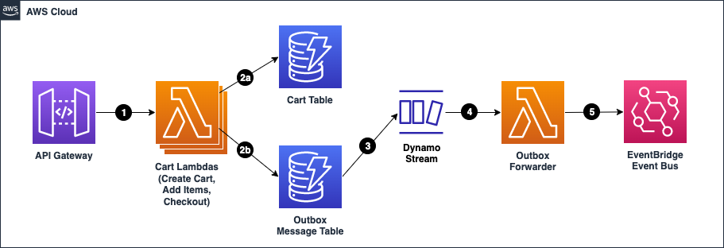

# Summary
The following pattern is serverless implementation of the transactional outbox pattern.   The transactional outbox is an event publishing pattern that leverages a database transaction to write to one more tables for the storage schema and a separate table that temporarily stores the outgoing message.  The outbox messages are then forwarded from the table to a messaging system.

This pattern uses API Gateway and Lambda to create an API, DynamoDB to store data, DynamoDB Streams as the change data capture source of events that need to be forwarded, and EventBridge to publish those events.

# Architecture
## Target architecture

1. Handle the cart request from the Rest API
1. Save the cart data to the Cart Table (2a) and save the event message to the Outbox Table (2b) using the TransactWriteItems operation.
1. DynamoDB Streams write the Outbox Table changes asynchronously in a time-ordered log.
1. The Outbox Forwarder Lambda is triggered by change records from the DynamoDB stream
1. The Outbox Forwarder Lambda sends the events to the Event Bus

## Target technology stack
This pattern uses the following AWS Services:
- AWS API Gateway: An API Gateway Rest API is used to expose the shopping cart functionality.
- AWS Lambda: Lambda Functions are back the Rest API and for forwarding messages from the DynamoDB Table to the Event Bus.
- AWS DynamoDB: A Table is used to store the shopping cart data and another for Outbox messages.
- AWS DynamoDB Streams: A Stream is enabled on the Outbox Table to trigger the messages to be forwarded to the Event Bus.
- AWS EventBridge: Event Bus for publishing events to.
- AWS CloudWatch Logs: A Log Group is used to write all the events that are published to the Event bus.

# Tools
AWS CDK is a software development framework for defining cloud infrastructure in code and provisioning it through AWS CLoudFormation.

# Prerequisites
The following software is necessary in order to deploy this pattern:
- An active AWS account
- A valid user and credentials, with the correct permissions to run the AWS CDK
- [npm](https://docs.npmjs.com/about-npm) installed and configured
- [AWS CDK Toolkit](https://docs.aws.amazon.com/cdk/v2/guide/getting_started.html) installed and configured

## Product versions
This pattern has been built and tested using the following tools and versions:
- AWS CDK 2.70.0
- npm 8.19.2


# Setup
## Install npm packages
From the root of the repository run the following command:
```terminal
npm i
```

## Bootstrap the CDK (Optional)
If you have not already bootsraped the CDK, you will need to run the following command supplying the your account and region:
```terminal
cdk bootstrap aws://{your account}/{your region}
```

## Login to your AWS Account
Log into your AWS account and make sure that your AWS CLI credentials are set and configured properly.

If you have not setup your AWS credentials, please follow the [following instructions](https://docs.aws.amazon.com/cli/latest/userguide/cli-chap-configure.html).

<insert content>

# Deploying the AWS resources
From the root of the repository run the following command:
```terminal
npm run build && cdk deploy
```

# Cleanup
From the root of the repository run the following command:
```terminal
cdk destroy
```
